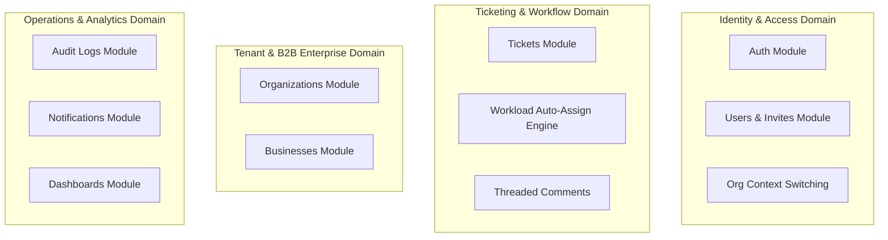

# Fonu Desk - Product & System Architecture (C4 Level 1 & Level 2 Container Views)

This document provides a Product-Owner (PO) level architectural overview of the Fonu Desk Backend application. It maps business capabilities, user journeys, domain boundaries, security perimeters, third-party integrations, and operational constraints to system components.

---

## 1. High-Level Product Architecture Diagram

The C4 Level 2 Container View visually outlines how user personas interact with core backend feature domains, database stores, security perimeters, and third-party vendors:


---

## 2. User Personas & System Entry Points

| User Persona | Entry Point | Auth & Security Boundaries | Core Business Capabilities |
|---|---|---|---|
| **Organization Owner (Admin)** | Next.js Web App | JWT Bearer Token, `OWNER` Role Guard, Tenant Scoped (`organizationId`) | Full organization settings, invitation management, ticket assignment configuration (`AUTO` vs `MANUAL`), B2B Customer Business onboarding, system audit logs, admin dashboard analytics. |
| **Support Agent** | Next.js Web App | JWT Bearer Token, `SUPPORT` Role Guard, Assigned Queue Scoping | View active workload queue, claim unassigned tickets, update ticket status/priority, write internal staff comments, track ticket update history. |
| **B2B End Customer** | Next.js Web App | JWT Bearer Token, `CUSTOMER` Role Guard, Creator Scoped (`createdById`) | Submit support tickets with base64 attachments (up to 10MB), view ticket status updates (with sanitized agent privacy details - no agent emails exposed), post public thread comments. |

---

## 3. Core Business Domains & Bounded Contexts

The monolith codebase (`src/api/`) is structured into four bounded business domains:



### 3.1 Identity & Access Domain (`src/api/auth/`, `src/api/users/`)
- **Business Purpose**: Manages user registration, email verification via OTP, authentication, multi-tenant organization switching, and Role-Based Access Control (RBAC) user invitations.
- **Security Control**: Protected by `RateLimiterService` against brute-force attacks on sensitive endpoints:
  - `/auth/verify-email`: Max 6 attempts per 15 minutes.
  - `/auth/resend-verification-otp`: Max 6 attempts per 30 minutes.
  - `/auth/change-password`: Max 6 attempts per 15 minutes.

### 3.2 Ticketing & Workflow Domain (`src/api/tickets/`)
- **Business Purpose**: Core ticketing engine handling creation, status tracking (`OPEN`, `IN_PROGRESS`, `RESOLVED`, `CLOSED`), priority management, file attachment uploads, and comment threads.
- **Automated Workload Assignment**: When organization assignment strategy is set to `AUTO`, new tickets trigger an algorithm querying active support staff in the tenant and auto-assigning the ticket to the agent with the lowest active workload.
- **Customer Privacy Protection**: Ticket details and list endpoints sanitize `assignedTo` user objects for `CUSTOMER` role users, hiding the support agent's email address.

### 3.3 Tenant & B2B Enterprise Domain (`src/api/organizations/`, `src/api/businesses/`)
- **Business Purpose**: Manages enterprise tenant organizations and onboarded customer business entities (`Business`), ensuring strict multi-tenant data scoping using `organizationId`.

### 3.4 Operations & Analytics Domain (`src/api/audit-logs/`, `src/api/dashboards/`, `src/api/notifications/`)
- **Business Purpose**: Provides real-time dashboard metrics (Admin, Agent, Customer views), logs immutable audit trails for compliance, and dispatches branded email notifications via SMTP.

---

## 4. End-to-End Action-Labeled User Journeys

### Journey 1: Support Ticket Creation & Workload Auto-Assignment
```
[Customer] --(1) POST /tickets [Title, Description, Base64 Attachments]--> [API Gateway]
[API Gateway] --(2) Validate JWT & Rate Limits--> [TicketsService]
[TicketsService] --(3) Upload Base64 Files (Max 10MB)--> [Cloudinary Storage]
[TicketsService] --(4) Query Least-Busy Support Agent in Tenant--> [TicketsRepository]
[TicketsService] --(5) Persist Ticket & Assign Agent--> [PostgreSQL DB]
[TicketsService] --(6) Write Immutable Audit Record--> [AuditLogsService]
[TicketsService] --(7) Dispatch Branded Assignment Emails--> [SMTP Mail Service]
```

### Journey 2: Organization Context Switching (Multi-Tenant Users)
```
[User] --(1) POST /auth/switch-organization { organizationId }--> [API Gateway]
[API Gateway] --(2) Validate Membership/Ownership of Target Org--> [AuthService]
[AuthService] --(3) Update User Default Organization--> [PostgreSQL DB]
[AuthService] --(4) Issue New JWT Signed Token (Scoped Roles & OrgId)--> [User]
```

---

## 5. Third-Party Integrations, Constraints & Vendor SLAs

| Service / System | Domain | Integration Method | Constraints, SLAs & Costs |
|---|---|---|---|
| **PostgreSQL Database** | Data Persistence | Prisma ORM (`@prisma-pg`) | Primary relational data store. Enforces `organizationId` foreign key indexes for multi-tenant query performance. |
| **Redis / In-Memory Store** | Cache & Security | `RedisService` / Sliding Window | Stores key TTL counters for rate limiting. Returns HTTP `429 Too Many Requests` when limits are breached. |
| **Cloudinary Storage** | Media Storage | Base64 Upload API | Uploads attachments during ticket creation. Body parsers configured with `10mb` size limit. Returns CDN URLs. |
| **SMTP Mail Server / Mailtrap** | Communication | Nodemailer + Handlebars | Dispatches branded HTML emails (verification OTPs, invites, password resets, ticket assignment alerts). |

---

## 6. Security, Compliance & Data Privacy Boundaries

1. **Multi-Tenancy Perimeter**: Every database query scoped to tenant data must filter by `organizationId` extracted from the active user's verified JWT payload (`req.user.organizationId`).
2. **Data Privacy Guard**: Customer users are restricted from viewing staff emails (`assignedTo.email`) and internal staff notes (`isInternal: true` comments).
3. **Audit Compliance**: All state-changing actions (organization creation, user invitations, business onboarding, ticket status updates) automatically emit structured `AuditLog` records containing `actorId`, `action`, `entityType`, `entityId`, `organizationId`, and timestamp.
