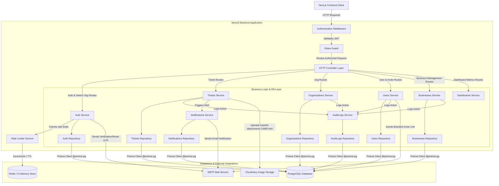

# Fonu Desk Backend - System Architecture

This document describes the architectural design, component layers, data flows, security scoping, rate limiting mechanisms, and infrastructure integrations of the Fonu Desk Backend API application.

---

## 1. High-Level Architecture Diagram

The backend application follows a modular monolith structure utilizing NestJS. Requests are filtered through a pipeline of middlewares and guards, processed by controllers, coordinated by business services, and saved to the database via database repositories using the Prisma ORM.

---

## 2. Architectural Layers

The codebase strictly adheres to the **Controller -> Service -> Repository -> DTO** pattern, establishing clean boundaries and separation of concerns.

### 2.1 HTTP Controller Layer
- **Role**: Entry point for HTTP requests. Handles routing, HTTP response status codes, Express body parser configuration (up to 10MB payload size limit for image attachments), and input stream validation.
- **Swagger Documentation**: Every controller endpoint includes a NestJS Swagger `@ApiResponse()` decorator with strongly typed `type` DTO responses for clean OpenAPI generation.
- **Rules**: Controllers do **not** contain business logic. They immediately delegate execution to the service layer.
- **Files**: Named `<name>.controller.ts`.

### 2.2 Middleware & Guards
- **Authentication Middleware**: Placed in `AuthenticationMiddleware` (`src/common/middlewares/auth.middleware.ts`). Decodes JWT Bearer tokens from incoming headers, validates signatures, and attaches the payload (`JwtPayload`) to `req.user`.
- **Roles Guard**: Placed in `RolesGuard` (`src/common/guards/roles.guard.ts`). Works with the `@Roles(...)` custom decorator to enforce Role-Based Access Control (RBAC) across endpoints (`OWNER`, `ADMIN`, `SUPPORT`, `CUSTOMER`).

### 2.3 Service Layer (Business Logic)
- **Role**: Contains core business logic, permission checks, rate limit validations, ticket auto-assignment algorithms, branded email dispatch, and audit logging.
- **Rules**: Services do **not** query the database directly. They delegate all database interactions to dedicated Repository classes.
- **Files**: Named `<name>.service.ts`.

### 2.4 Repository Layer (Data Access)
- **Role**: Handles database queries. Translates business requests into database operations using the Prisma Client.
- **Rules**: Imports Prisma clients and types exclusively from the custom `@prisma-pg` package.
- **Files**: Named `<name>.repository.ts`.

### 2.5 Data Transfer Objects (DTOs)
- **Role**: Defines request bodies, parameters, and query shapes. Leverages `class-validator` decorators (e.g., `@IsString()`, `@IsOptional()`) to validate inputs automatically.
- **Swagger Integration**: Fields use `@ApiProperty()` decorators with explicit types and descriptions.

### 2.6 Redis & Rate Limiting Engine
- **Role**: Provides sliding-window rate limiting for security-critical authentication endpoints.
- **Architecture**: `RedisService` (`src/common/redis/redis.service.ts`) implements key operations (`incr`, `expire`, `ttl`, `get`, `set`) backed by an in-memory storage fallback. `RateLimiterService` (`src/common/redis/rate-limiter.service.ts`) checks request frequencies and throws `429 TOO_MANY_REQUESTS` exceptions when limits are exceeded.

---

## 3. Core Architectural Patterns

### 3.1 Multi-Tenancy & Query Scoping
The application enforces strict data isolation between different Tenants (Organizations). All queries retrieving, modifying, or deleting tenant resources (Tickets, Customer Businesses, Users, Dashboards) scope database queries using the active user's `organizationId` (extracted from the authenticated JWT token).
- Cross-tenant requests (where resource `organizationId` does not match the active user's `organizationId`) are blocked with a `ForbiddenException` (403 status code).

### 3.2 Organization Context & Active Tenant Switching
Users belonging to or owning multiple organizations can switch their active organization context via `/auth/switch-organization`.
- Validates membership or ownership of the target organization.
- Updates the user's default organization (`defaultOrganizationId`) in the database.
- Issues a new JWT token containing the updated `organizationId` and role bindings.

### 3.3 Security Rate Limiting & Abuse Prevention
To protect auth endpoints against brute-force attacks and abuse, sliding window rate limits are enforced via `RateLimiterService`:
- **Email Verification (`/auth/verify-email`)**: Restricted to max 6 attempts per 15 minutes (900 seconds).
- **Resend Verification OTP (`/auth/resend-verification-otp`)**: Restricted to max 6 attempts per 30 minutes (1800 seconds).
- **Change Password (`/auth/change-password`)**: Restricted to max 6 attempts per 15 minutes (900 seconds).

### 3.4 Audit Trails
Sensitive business operations are logged via `AuditLogsService`. Immutable records containing action type, actor ID, entity type, affected entity ID, organization ID, and metadata are written into the `AuditLog` table for:
- Creating organizations.
- Inviting users and resending invitations.
- Onboarding and managing customer businesses.
- Ticket lifecycle actions (creating, updating status, changing priority, assigning agents, adding comments).

### 3.5 Automated Ticket Assignment
When an organization operates with `ticketAssignMethod = 'AUTO'`, creating a ticket automatically triggers the assignment algorithm:
- Queries the repository to count open/assigned tickets per active support agent (`SUPPORT` role membership) within the tenant organization.
- Auto-assigns the ticket to the agent with the lowest active workload.
- Leaves the ticket unassigned if no active support staff exist.

### 3.6 Customer Business Management
Support and owner roles can onboard customer businesses (`Business`) scoped under their organization:
- Maps B2B customer accounts to specific business entities.
- Allows tickets to be associated with both the tenant Organization and the Customer Business.

---

## 4. Third-Party Services & Integrations

- **Prisma Client (`@prisma-pg`)**: Connects to the PostgreSQL database using `@prisma/adapter-pg`.
- **Redis & Rate Limiting Engine**: Handles in-memory/Redis TTL key counters to enforce security rate limits on auth routes.
- **SMTP Mail Server & Handlebars Templates**: Interfaced via Nodemailer using branded Handlebars templates (`src/email/templates/`) formatted with Fonu Desk design system colors to send invitation links, verification OTPs, password reset codes, and ticket notifications.
- **Cloudinary Storage**: Processes base64-encoded image attachments uploaded during ticket creation (supporting up to 10MB payloads), uploads them securely to Cloudinary, and persists public image URLs.
