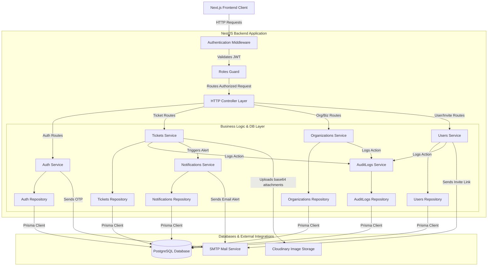

# Fonu Desk Backend - System Architecture

This document describes the architectural design, component layers, data flows, and security scoping of the Fonu Desk Backend API application.

---

## 1. High-Level Architecture Diagram

The backend application follows a modular monolith structure utilizing NestJS. Requests are filtered through a pipeline of middlewares and guards, processed by controllers, coordinated by business services, and saved to the database via database repositories using the Prisma ORM.

---

## 2. Architectural Layers

The codebase strictly adheres to the **Controller -> Service -> Repository -> DTO** pattern, establishing clean boundaries and separation of concerns.

### 2.1 HTTP Controller Layer
- **Role**: Entry point for HTTP requests. Handles routing, HTTP response status codes, Swagger documentation, and maps input streams.
- **Rules**: Controllers do **not** contain business logic. They immediately delegate execution to the service layer.
- **Files**: Named `<name>.controller.ts`.

### 2.2 Middleware & Guards
- **Authentication Middleware**: Placed in `AuthenticationMiddleware` (`src/common/middlewares/auth.middleware.ts`). Decodes JWT Bearer tokens from incoming headers, validates them, and attaches the payload (`JwtPayload`) to `req.user`.
- **Roles Guard**: Placed in `RolesGuard` (`src/common/guards/roles.guard.ts`). Works with the `@Roles(...)` custom decorator to block unauthorized access to endpoints based on user roles (`OWNER`, `ADMIN`, `SUPPORT`, `CUSTOMER`).

### 2.3 Service Layer (Business Logic)
- **Role**: Contains the core business logic, permissions enforcement, auto-assignment algorithms, template generation, and transaction orchestrations.
- **Rules**: Services do **not** query the database directly. They delegate all database interactions to the Repository layer.
- **Files**: Named `<name>.service.ts`.

### 2.4 Repository Layer (Data Access)
- **Role**: Handles database queries. Translates high-level query needs into database commands using the Prisma Client.
- **Rules**: Imports Prisma clients and types exclusively from the custom `@prisma-pg` package.
- **Files**: Named `<name>.repository.ts`.

### 2.5 Data Transfer Objects (DTOs)
- **Role**: Defines request bodies, parameters, and query shapes. Leverages `class-validator` decorators (e.g. `@IsString()`, `@IsOptional()`) to validate inputs automatically before they hit the controller.
- **Swagger Documentation**: Responses use strongly typed DTOs with Swagger decorators like `@ApiProperty()` and `@ApiResponse()` for clear schema definitions.

---

## 3. Core Architectural Patterns

### 3.1 Multi-Tenancy & Query Scoping
The application enforces strict data isolation between different Tenants (Organizations). All queries that retrieve, modify, or delete tenant resources (Tickets, Businesses, Users) scope their SQL queries using the active user's `organizationId` (extracted from the JWT token payload).
- Cross-tenant requests (where the resource `organizationId` does not match the active user's `organizationId`) are blocked with a `ForbiddenException` (403 status code).

### 3.2 Audit Trails
Sensitive business operations are tracked via the `AuditLogsService`. An audit record containing the action type, actor ID, entity type, affected entity ID, organization ID, and custom metadata is written into the `AuditLog` database table for:
- Creating organizations.
- Inviting users and resending invitations.
- Onboarding businesses.
- Ticket lifecycle actions (creating, updating, assigning, adding comments).

### 3.3 Automated Ticket Assignment
When an organization is configured with `ticketAssignMethod = 'AUTO'`, creating a new ticket automatically triggers the assignment algorithm. The system queries the database to find the least busy support agent (active, non-deleted membership matching the `SUPPORT` role) in that organization and automatically assigns the ticket to them. If no support agents exist, it remains unassigned.

---

## 4. Third-Party Services & Integrations

- **Prisma Client (`@prisma-pg`)**: Integrates with PostgreSQL database using the `@prisma/adapter-pg` driver.
- **SMTP Mail Server**: Interfaced via Nodemailer and `@nestjs-modules/mailer` utilizing Handlebars templates (`src/email/templates/`) to dispatch formatted user invitation links, verify-email OTPs, and ticket assignment or update notifications.
- **Cloudinary**: Handles base64-encoded image attachments uploaded during ticket creation, returns secure URLs, and stores them in Cloudinary buckets.
