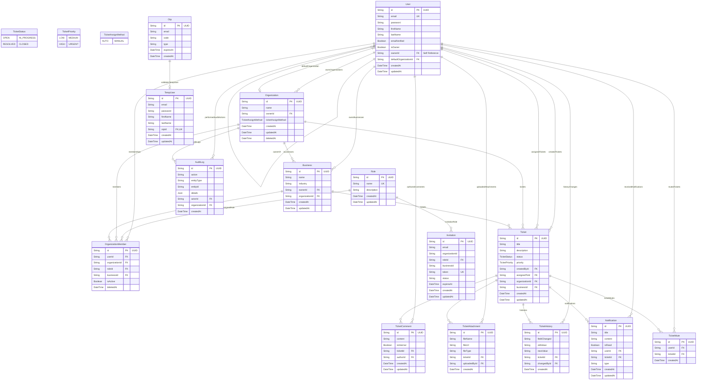

# Fonu Desk - Entity Relationship Diagram (ERD) & Database Schema

This document provides a comprehensive Entity Relationship Diagram (ERD) and data dictionary for the **Fonu Desk PostgreSQL Database** managed via **Prisma ORM** (`@prisma-pg`).

---

## 1. Complete Entity Relationship Diagram (Mermaid)

---

## 2. Data Dictionary & Entity Descriptions

### 2.1 `User`
Stores registered user accounts across the system.

| Field Name | Type | Constraints | Description |
|---|---|---|---|
| `id` | `String` | `@id`, `@default(uuid())` | Primary key UUID |
| `email` | `String` | `@unique` | Unique user email address |
| `password` | `String` | Required | Bcrypt hashed password |
| `firstName` | `String` | Required | User first name |
| `lastName` | `String` | Required | User last name |
| `emailVerified` | `Boolean` | `@default(false)` | Flag indicating OTP verification state |
| `isOwner` | `Boolean` | `@default(false)` | Flag indicating system organization owner status |
| `ownerId` | `String` | Nullable, `FK -> User.id` | Self-referencing owner link |
| `defaultOrganizationId` | `String` | Nullable, `FK -> Organization.id` | Active tenant organization context |
| `createdAt` | `DateTime` | `@default(now())` | Account creation timestamp |
| `updatedAt` | `DateTime` | `@updatedAt` | Profile update timestamp |

---

### 2.2 `Role`
Defines Role-Based Access Control (RBAC) permissions.

| Field Name | Type | Constraints | Description |
|---|---|---|---|
| `id` | `String` | `@id`, `@default(uuid())` | Primary key UUID |
| `name` | `String` | `@unique` | System role identifier (`OWNER`, `ADMIN`, `SUPPORT`, `CUSTOMER`) |
| `description` | `String` | Nullable | Role capabilities description |

---

### 2.3 `Organization`
Represents top-level SaaS tenant environments.

| Field Name | Type | Constraints | Description |
|---|---|---|---|
| `id` | `String` | `@id`, `@default(uuid())` | Primary key UUID |
| `name` | `String` | Required | Tenant organization name |
| `ownerId` | `String` | `FK -> User.id` | Organization owner reference |
| `ticketAssignMethod` | `Enum` | `AUTO` / `MANUAL`, `@default(MANUAL)` | Strategy for ticket workload assignment |
| `deletedAt` | `DateTime` | Nullable | Soft deletion timestamp |

- **Composite Key**: `@@unique([name, ownerId])`

---

### 2.4 `OrganizationMember`
Join table connecting Users, Organizations, Roles, and optional Customer Businesses.

| Field Name | Type | Constraints | Description |
|---|---|---|---|
| `id` | `String` | `@id`, `@default(uuid())` | Primary key UUID |
| `userId` | `String` | `FK -> User.id`, `onDelete: Cascade` | Member user reference |
| `organizationId` | `String` | `FK -> Organization.id`, `onDelete: Cascade` | Tenant organization reference |
| `roleId` | `String` | `FK -> Role.id`, `onDelete: Restrict` | Assigned role reference |
| `businessId` | `String` | Nullable, `FK -> Business.id`, `onDelete: SetNull` | Associated customer business |
| `isActive` | `Boolean` | `@default(true)` | Membership status flag |
| `deletedAt` | `DateTime` | Nullable | Soft deletion timestamp |

- **Composite Key**: `@@unique([userId, organizationId])`

---

### 2.5 `Business`
Represents B2B customer enterprise accounts onboarded under an Organization.

| Field Name | Type | Constraints | Description |
|---|---|---|---|
| `id` | `String` | `@id`, `@default(uuid())` | Primary key UUID |
| `name` | `String` | Required | Customer business name |
| `industry` | `String` | Nullable | Industry classification |
| `ownerId` | `String` | `FK -> User.id` | Creator/Owner user reference |
| `organizationId` | `String` | `FK -> Organization.id`, `onDelete: Cascade` | Tenant organization reference |

---

### 2.6 `Ticket`
Represents support tickets submitted by customers or created on their behalf.

| Field Name | Type | Constraints | Description |
|---|---|---|---|
| `id` | `String` | `@id`, `@default(uuid())` | Primary key UUID |
| `title` | `String` | Required | Ticket summary title |
| `description` | `String` | Required | Detailed issue description |
| `status` | `TicketStatus` | `OPEN`, `IN_PROGRESS`, `RESOLVED`, `CLOSED` | Ticket lifecycle state |
| `priority` | `TicketPriority` | `LOW`, `MEDIUM`, `HIGH`, `URGENT` | Issue urgency level |
| `createdById` | `String` | `FK -> User.id` | Customer/Creator user reference |
| `assignedToId` | `String` | Nullable, `FK -> User.id` | Assigned support agent reference |
| `organizationId` | `String` | `FK -> Organization.id`, `onDelete: Cascade` | Tenant organization scoping |
| `businessId` | `String` | Nullable, `FK -> Business.id` | Customer business association |

---

### 2.7 `TicketComment`
Stores threaded conversation messages on tickets.

| Field Name | Type | Constraints | Description |
|---|---|---|---|
| `id` | `String` | `@id`, `@default(uuid())` | Primary key UUID |
| `content` | `String` | Required | Message text content |
| `isInternal` | `Boolean` | `@default(false)` | Flag restricting message visibility to staff |
| `ticketId` | `String` | `FK -> Ticket.id`, `onDelete: Cascade` | Parent ticket reference |
| `authorId` | `String` | `FK -> User.id` | Author user reference |

---

### 2.8 `TicketAttachment`
Tracks Cloudinary file attachments associated with tickets.

| Field Name | Type | Constraints | Description |
|---|---|---|---|
| `id` | `String` | `@id`, `@default(uuid())` | Primary key UUID |
| `fileName` | `String` | Required | Original filename |
| `fileUrl` | `String` | Required | Cloudinary CDN access URL |
| `fileType` | `String` | Nullable | MIME type (e.g. `image/png`) |
| `ticketId` | `String` | `FK -> Ticket.id`, `onDelete: Cascade` | Parent ticket reference |
| `uploadedById` | `String` | `FK -> User.id` | Uploader user reference |

---

### 2.9 `TicketHistory`
Automated audit log tracking field changes over a ticket's lifetime.

| Field Name | Type | Constraints | Description |
|---|---|---|---|
| `id` | `String` | `@id`, `@default(uuid())` | Primary key UUID |
| `fieldChanged` | `String` | Required | Name of changed field (e.g. `status`, `priority`) |
| `oldValue` | `String` | Nullable | Field value prior to update |
| `newValue` | `String` | Nullable | Updated field value |
| `ticketId` | `String` | `FK -> Ticket.id`, `onDelete: Cascade` | Parent ticket reference |
| `changedById` | `String` | `FK -> User.id` | Actor user reference |

---

### 2.10 `AuditLog`
System-wide immutable action log capturing sensitive events for compliance.

| Field Name | Type | Constraints | Description |
|---|---|---|---|
| `id` | `String` | `@id`, `@default(uuid())` | Primary key UUID |
| `action` | `String` | Required | Action identifier (e.g. `CREATE_TICKET`, `ASSIGN_TICKET`) |
| `entityType` | `String` | Required | Entity category (`Ticket`, `Organization`, `Business`) |
| `entityId` | `String` | Required | Target entity UUID |
| `details` | `Json` | Nullable | Additional structured action metadata |
| `actorId` | `String` | `FK -> User.id` | User performing action |
| `organizationId` | `String` | Nullable, `FK -> Organization.id` | Tenant organization context |

---

### 2.11 `TempUser` & `Otp`
Staging tables managing email verification and password resets.

| Table | Field Name | Type | Constraints | Description |
|---|---|---|---|---|
| **TempUser** | `id` | `String` | `@id`, `@default(uuid())` | Staging record ID |
| | `email` | `String` | `@@index([email])` | Unverified registration email |
| | `otpId` | `String` | Nullable, `@unique`, `FK -> Otp.id` | Linked OTP reference |
| **Otp** | `id` | `String` | `@id`, `@default(uuid())` | OTP record ID |
| | `email` | `String` | `@@index([email])` | Target email |
| | `code` | `String` | Required | 6-digit validation code |
| | `type` | `String` | Required | `VERIFY_EMAIL` / `RESET_PASSWORD` |
| | `expiresAt` | `DateTime` | Required | Expiration timestamp |

---

### 2.12 `Invitation`
Manages pending and accepted organization member invitations.

| Field Name | Type | Constraints | Description |
|---|---|---|---|
| `id` | `String` | `@id`, `@default(uuid())` | Primary key UUID |
| `email` | `String` | Required | Invitee email address |
| `organizationId` | `String` | Required | Target tenant organization |
| `roleId` | `String` | `FK -> Role.id` | Target member role |
| `businessId` | `String` | Nullable | Optional B2B customer business association |
| `token` | `String` | `@unique` | Secure invitation token |
| `status` | `String` | `@default("PENDING")` | Status (`PENDING`, `ACCEPTED`) |
| `expiresAt` | `DateTime` | Required | Invitation expiration timestamp |

---

### 2.13 `Notification` & `TicketMute`
Manages in-app notifications and user ticket mute preferences.

| Table | Field Name | Type | Constraints | Description |
|---|---|---|---|---|
| **Notification** | `id` | `String` | `@id`, `@default(uuid())` | Notification ID |
| | `title` | `String` | Required | Notification title |
| | `content` | `String` | Required | Notification body text |
| | `isRead` | `Boolean` | `@default(false)` | Read state flag |
| | `userId` | `String` | `FK -> User.id`, `onDelete: Cascade` | Recipient user |
| | `ticketId` | `String` | Nullable, `FK -> Ticket.id` | Related ticket reference |
| **TicketMute** | `id` | `String` | `@id`, `@default(uuid())` | Mute record ID |
| | `userId` | `String` | `FK -> User.id`, `onDelete: Cascade` | User reference |
| | `ticketId` | `String` | `FK -> Ticket.id`, `onDelete: Cascade` | Muted ticket reference |

- **Composite Key**: `TicketMute`: `@@unique([userId, ticketId])`

---

## 3. Database Indexes & Performance Scoping

To ensure multi-tenant performance and data isolation:

1. **Multi-Tenant Indexing**: Queries filtering by `organizationId` are optimized via foreign key indexes on `Ticket`, `OrganizationMember`, `Business`, and `AuditLog`.
2. **Unique Composite Indexing**:
   - `OrganizationMember`: `@@unique([userId, organizationId])` prevents duplicate memberships.
   - `Organization`: `@@unique([name, ownerId])` prevents duplicate org names per owner.
   - `TicketMute`: `@@unique([userId, ticketId])` prevents duplicate ticket mute entries.
3. **Lookup Indexing**:
   - `TempUser` and `Otp`: `@@index([email])` accelerates fast OTP verification lookups.
